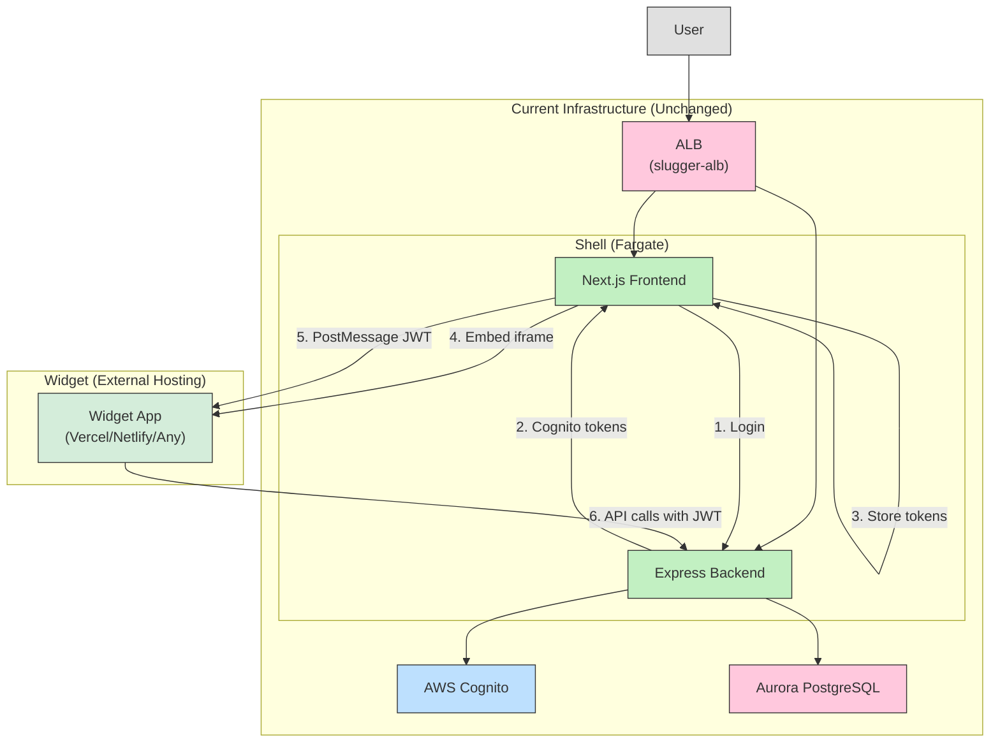
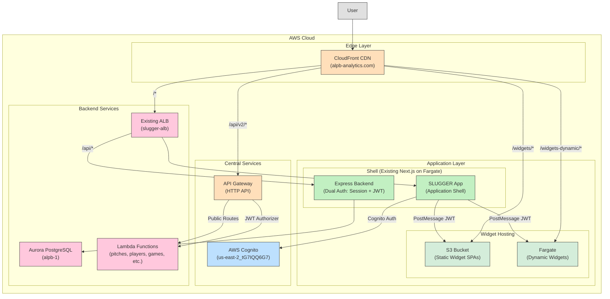
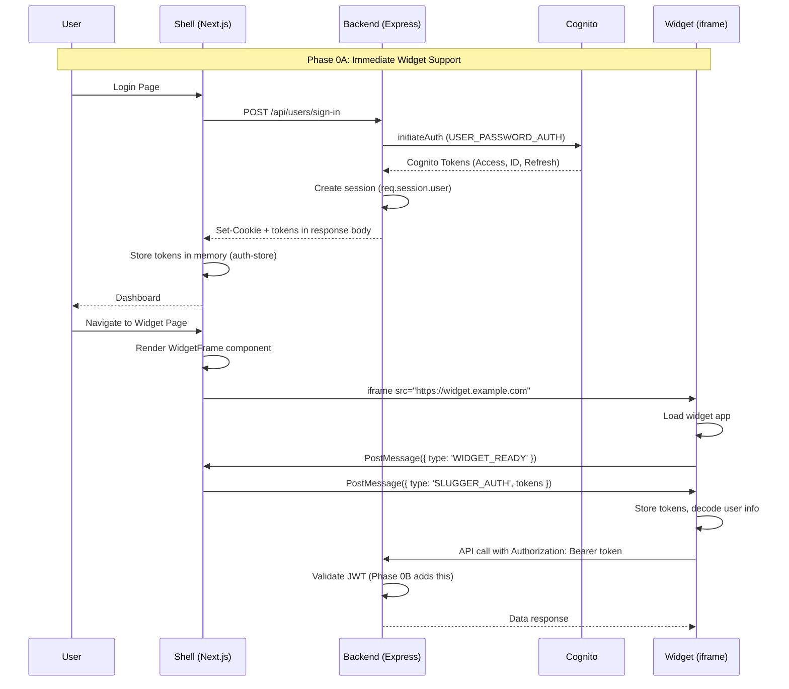

# Development Plan: Unified Platform Migration

**Date:** November 29, 2025  
**Status:** Approved for Development  
**Target:** Engineering Team

---

## 1. Executive Summary

This plan migrates the **SLUGGER web application** from a session-based monolith to a **Hub-and-Spoke Platform** where:

- The **existing Next.js app becomes the Application Shell** (Hub)
- **Widgets are served as embedded sub-apps** (Spokes) via iframe/PostMessage
- Authentication transitions from **server-side sessions to stateless JWT**
- Infrastructure adds **CloudFront + API Gateway** in front of existing ALB/Fargate

### Key Change: Widget-First Priority

To unblock widget developers immediately, we've restructured the phases:

1. **Phase 0A (PRIORITY):** Implement PostMessage token passing with zero infrastructure changes
2. **Phase 0B:** Backend dual-auth support (parallel track)
3. **Phase 1+:** AWS infrastructure migration (deferred)

### Current State → Target State

| Aspect | Current | Phase 0A (Immediate) | Final Target |
|--------|---------|---------------------|--------------|
| Entry Point | ALB DNS | ALB DNS (unchanged) | CloudFront |
| Auth Model | Session cookies | Session + Client JWT | Dual-mode everywhere |
| Widget Integration | External links | Embedded iframes + PostMessage | Same |
| API Routing | ALB path rules | ALB (unchanged) | CloudFront → API Gateway |

---

## 2. Architecture Overview

### 2.1 Phase 0A Architecture (Immediate - No Infrastructure Changes)



### 2.2 Final Target Architecture



### 2.3 Authentication Flow



---

## 3. Development Phases

### Phase 0A: Widget Token Passing (PRIORITY - 1-2 Days)

**Goal:** Enable widget developers to receive authentication tokens immediately with ZERO infrastructure changes.

#### 0A.1 Tasks

- [x] Modify login endpoint to return Cognito tokens in response body
- [x] Create `auth-store.ts` for client-side token storage
- [x] Create `WidgetFrame.tsx` component with PostMessage
- [x] Create Widget Developer Guide (separate document)
- [x] Create `slugger-widget-sdk.ts` snippet for widget developers

#### 0A.2 Backend Change: Return Tokens on Login

**File:** `backend/api/users.js`

```javascript
// In POST /sign-in handler, after successful auth:
res.status(200).json({
  success: true,
  message: "Login successful",
  data: {
    // Note: Implementation uses 'authData' key (not 'tokens')
    authData: {
      accessToken: AccessToken,
      idToken: IdToken,
      refreshToken: RefreshToken,
      expiresIn: authResult.AuthenticationResult.ExpiresIn
    },
    user: {
      email: user.email,
      first: user.first_name,
      last: user.last_name,
      role: user.role,
      id: user.user_id,
      teamId: user.team_id,
      teamRole: user.team_role,
      is_admin: user.is_admin
    }
  }
});
```

#### 0A.3 Frontend: Token Storage

**File:** `frontend/src/lib/auth-store.ts`

> **Implementation Note:** The actual implementation uses `localStorage` instead of pure in-memory storage. This is required for development environments where browser preview proxies use different origins (e.g., `127.0.0.1:port` vs `localhost:3000`). In production, this is acceptable because:
>
> - Widgets are on different domains and **cannot access** the shell's localStorage (same-origin policy)
> - Tokens are passed to widgets **only via PostMessage**
> - The Widget SDK stores tokens in memory (not localStorage)

```typescript
import { atom } from 'nanostores';

export interface AuthUser {
  id: string;
  email: string;
  firstName: string;
  lastName: string;
  role: string;
  teamId?: string;
  teamRole?: string;
  isAdmin?: boolean;
}

export interface AuthTokens {
  accessToken: string;
  idToken: string;
  refreshToken: string;
  expiresAt: number;
  user?: AuthUser; // User info for widget integration
}

const STORAGE_KEY = "slugger_auth_tokens";

// Initialize from localStorage if available
function getInitialTokens(): AuthTokens | null {
  if (typeof window === "undefined") return null;
  try {
    const stored = localStorage.getItem(STORAGE_KEY);
    if (!stored) return null;
    const tokens = JSON.parse(stored) as AuthTokens;
    if (Date.now() > tokens.expiresAt) {
      localStorage.removeItem(STORAGE_KEY);
      return null;
    }
    return tokens;
  } catch {
    return null;
  }
}

export const $authTokens = atom<AuthTokens | null>(getInitialTokens());

export function setAuthTokens(
  tokens: { accessToken: string; idToken: string; refreshToken: string; expiresIn: number },
  user?: { id: string; email: string; first: string; last: string; role: string; /* ... */ }
): void {
  const authTokens: AuthTokens = {
    ...tokens,
    expiresAt: Date.now() + tokens.expiresIn * 1000,
    user: user ? { id: user.id, email: user.email, firstName: user.first, /* ... */ } : undefined,
  };
  $authTokens.set(authTokens);
  localStorage.setItem(STORAGE_KEY, JSON.stringify(authTokens));
}

// Additional functions: clearAuthTokens, getAccessToken, getTokensForWidget, etc.
```

#### 0A.4 Frontend: WidgetFrame Component

**New file:** `frontend/src/components/WidgetFrame.tsx`

```tsx
'use client';

import { useEffect, useRef, useState } from 'react';
import { useStore } from '@nanostores/react';
import { $authTokens } from '@/lib/auth-store';

interface WidgetFrameProps {
  src: string;
  title: string;
  widgetId: string;
  className?: string;
  onError?: (error: string) => void;
}

export function WidgetFrame({ 
  src, 
  title, 
  widgetId,
  className = 'w-full h-[600px] border-0',
  onError 
}: WidgetFrameProps) {
  const iframeRef = useRef<HTMLIFrameElement>(null);
  const tokens = useStore($authTokens);
  const [isReady, setIsReady] = useState(false);

  // Listen for messages from widget
  useEffect(() => {
    const handleMessage = (event: MessageEvent) => {
      // Validate origin
      try {
        const widgetOrigin = new URL(src).origin;
        if (event.origin !== widgetOrigin) return;
      } catch {
        return;
      }

      if (event.data?.type === 'SLUGGER_WIDGET_READY') {
        setIsReady(true);
        // Send tokens immediately when widget is ready
        sendTokens();
      } else if (event.data?.type === 'SLUGGER_TOKEN_REFRESH') {
        // Widget requesting fresh tokens
        sendTokens();
      }
    };

    window.addEventListener('message', handleMessage);
    return () => window.removeEventListener('message', handleMessage);
  }, [src, tokens]);

  const sendTokens = () => {
    if (!iframeRef.current?.contentWindow || !tokens) return;

    try {
      const widgetOrigin = new URL(src).origin;
      iframeRef.current.contentWindow.postMessage({
        type: 'SLUGGER_AUTH',
        payload: {
          accessToken: tokens.accessToken,
          idToken: tokens.idToken,
          expiresAt: tokens.expiresAt,
          // Implementation includes user info for widget developers
          user: tokens.user
        }
      }, widgetOrigin);
    } catch (error) {
      onError?.('Failed to send auth tokens to widget');
    }
  };

  // Also send tokens when iframe loads (fallback)
  const handleLoad = () => {
    // Give widget time to set up listener
    setTimeout(sendTokens, 100);
  };

  return (
    <iframe
      ref={iframeRef}
      src={src}
      title={title}
      className={className}
      onLoad={handleLoad}
      sandbox="allow-scripts allow-same-origin allow-forms allow-popups"
    />
  );
}
```

#### 0A.5 Success Criteria

- [x] Login returns tokens in response body
- [x] Tokens stored on frontend (localStorage with cross-origin security)
- [x] WidgetFrame component sends tokens via PostMessage
- [x] Widget developer can receive and decode tokens
- [x] No infrastructure changes required
- [x] Proactive token refresh (5 min before expiry)
- [x] User info included in SLUGGER_AUTH payload

---

### Phase 0B: Backend JWT Validation (Week 1-2, Parallel Track)

**Goal:** Enable backend to validate JWT tokens from widgets for API calls.

#### 0B.1 Tasks

- [ ] Add `jwks-rsa` package for Cognito key fetching
- [ ] Create `jwt-validator.js` middleware
- [ ] Modify `requireAuth` to support both session and JWT
- [ ] Test with widget making authenticated API calls

#### 0B.2 Code Changes

**New file:** `backend/middleware/jwt-validator.js`

```javascript
import jwt from 'jsonwebtoken';
import jwksClient from 'jwks-rsa';

const COGNITO_REGION = 'us-east-2';
const USER_POOL_ID = process.env.COGNITO_USER_POOL_ID;

const client = jwksClient({
  jwksUri: `https://cognito-idp.${COGNITO_REGION}.amazonaws.com/${USER_POOL_ID}/.well-known/jwks.json`,
  cache: true,
  cacheMaxAge: 86400000 // 24 hours
});

function getSigningKey(header, callback) {
  client.getSigningKey(header.kid, (err, key) => {
    if (err) return callback(err);
    callback(null, key.getPublicKey());
  });
}

export async function validateCognitoJWT(token) {
  return new Promise((resolve, reject) => {
    jwt.verify(
      token,
      getSigningKey,
      {
        issuer: `https://cognito-idp.${COGNITO_REGION}.amazonaws.com/${USER_POOL_ID}`,
        algorithms: ['RS256']
      },
      (err, decoded) => {
        if (err) return reject(err);
        resolve(decoded);
      }
    );
  });
}
```

**Modified:** `backend/middleware/permission-guards.js`

```javascript
import { validateCognitoJWT } from './jwt-validator.js';

export const requireAuth = async (req, res, next) => {
  // Path 1: Existing session auth (unchanged)
  if (req.session?.user) {
    req.user = req.session.user;
    return next();
  }
  
  // Path 2: JWT auth (new - for widgets)
  const authHeader = req.headers.authorization;
  if (authHeader?.startsWith('Bearer ')) {
    try {
      const token = authHeader.slice(7);
      const decoded = await validateCognitoJWT(token);
      
      // Map Cognito claims to user object
      req.user = {
        cognito_user_id: decoded.sub,
        email: decoded.email,
        // Note: role/permissions need DB lookup or custom claims
      };
      req.isJwtAuth = true; // Flag for downstream middleware
      return next();
    } catch (error) {
      console.error('JWT validation failed:', error.message);
      // Fall through to 401
    }
  }
  
  return res.status(401).json({ 
    success: false, 
    message: "Authentication required" 
  });
};
```

#### 0B.3 Success Criteria

- [ ] Backend validates Cognito JWTs
- [ ] Protected routes accept Bearer tokens
- [ ] Existing session auth continues to work
- [ ] Widget can make authenticated API calls

---

### Phase 1: Infrastructure Foundation (Week 3-4)

**Goal:** Deploy CloudFront as transparent proxy, prepare API Gateway.

#### 1.1 CloudFront Setup

- [ ] Create CloudFront distribution with custom domain (`alpb-analytics.com`)
- [ ] Configure origin: existing ALB (`slugger-alb-1518464736.us-east-2.elb.amazonaws.com`)
- [ ] Set up SSL certificate (ACM)
- [ ] Configure cache behaviors:
  - `/*` → ALB (existing app)
  - `/widgets/*` → S3 (future)
  - `/api/v2/*` → API Gateway (future)

#### 1.2 API Gateway Setup

- [ ] Create HTTP API in API Gateway
- [ ] Configure JWT Authorizer with Cognito User Pool
- [ ] Create routes for Lambda functions:
  - `GET /api/v2/pitches` → `pitches_endpoint`
  - `GET /api/v2/players` → `players_endpoint`
  - `GET /api/v2/games` → `games_endpoint`
  - `GET /api/v2/teams` → `teams_endpoint`
  - `GET /api/v2/ballpark` → `ballpark_endpoint`
- [ ] Configure public vs protected routes

#### 1.3 S3 Widget Bucket

- [ ] Create S3 bucket for static widget hosting (`slugger-widgets`)
- [ ] Configure bucket policy for CloudFront OAC
- [ ] Set up CORS for PostMessage communication

#### 1.4 Infrastructure as Code

```
aws/
├── cloudformation/
│   ├── cloudfront.yaml
│   ├── api-gateway.yaml
│   └── s3-widgets.yaml
└── scripts/
    └── deploy-infra.sh
```

#### 1.5 Success Criteria

- CloudFront serves existing app with no functionality changes
- API Gateway routes work with JWT authentication
- S3 bucket ready for widget deployment

---

### Phase 2: S3 Widget Hosting (Week 5-6)

**Goal:** Migrate widgets from external hosting to S3.

#### 2.1 Tasks

- [ ] Create CI/CD template for S3 widget deployment
- [ ] Migrate pilot widget to S3
- [ ] Update CloudFront routing for `/widgets/*`
- [ ] Test end-to-end flow

#### 2.2 CI/CD Template

**New file:** `.github/workflows/deploy-widget.yml`

```yaml
name: Deploy Widget to S3
on:
  push:
    paths:
      - 'widgets/**'
jobs:
  deploy:
    runs-on: ubuntu-latest
    steps:
      - uses: actions/checkout@v4
      - name: Build Widget
        run: npm run build
        working-directory: widgets/${{ matrix.widget }}
      - name: Deploy to S3
        run: aws s3 sync dist/ s3://slugger-widgets/${{ matrix.widget }}/
```

---

### Phase 3: General Rollout (Week 7+)

**Goal:** Migrate remaining widgets, deprecate old patterns.

#### 3.1 Widget Migration Checklist

For each widget:

- [ ] Categorize: Static (S3) vs Dynamic (Fargate)
- [ ] Categorize: Public vs Protected
- [ ] Update to use Widget SDK
- [ ] Update CI/CD to use appropriate template
- [ ] Test in staging environment
- [ ] Deploy to production

#### 3.2 Deprecation

- [ ] Remove direct widget links from dashboard (replace with embedded frames)
- [ ] Update documentation
- [ ] Announce deprecation timeline for old endpoints

---

## 4. Technical Specifications

### 4.1 PostMessage Protocol (Contract)

See **Widget Developer Guide** for complete specification.

```typescript
// Shell → Widget
interface SluggerAuthMessage {
  type: 'SLUGGER_AUTH';
  payload: {
    accessToken: string;
    idToken: string;
    expiresAt: number;
    // User info included for convenience (avoids JWT decoding)
    user?: {
      id: string;
      email: string;
      firstName: string;
      lastName: string;
      role: string;
      teamId?: string;
      teamRole?: string;
      isAdmin?: boolean;
    };
  };
}

// Widget → Shell
interface WidgetReadyMessage {
  type: 'SLUGGER_WIDGET_READY';
  widgetId: string;
}

interface TokenRefreshRequest {
  type: 'SLUGGER_TOKEN_REFRESH';
}
```

### 4.2 Widget Hosting Strategy

| Widget Type | Hosting | CloudFront Path | Auth |
|-------------|---------|-----------------|------|
| Static SPA (React/Vue) | S3 | `/widgets/{name}/*` | PostMessage JWT |
| Dynamic/SSR | Fargate | `/widgets-dynamic/{name}/*` | PostMessage JWT |
| Public Tool | S3 | `/tools/{name}/*` | None |
| External (Phase 0A) | Any | N/A | PostMessage JWT |

### 4.3 API Endpoints for Widgets

| Route | Method | Auth | Target |
|-------|--------|------|--------|
| `/api/*` | * | JWT or Session | Express Backend |
| `/api/v2/pitches` | GET | JWT | Lambda (future) |
| `/api/v2/players` | GET | JWT | Lambda (future) |
| `/api/v2/games` | GET | JWT | Lambda (future) |
| `/api/v2/teams` | GET | None | Lambda (future) |
| `/api/v2/ballpark` | GET | None | Lambda (future) |

### 4.4 Security Considerations

- **Origin Validation:** Shell validates widget origin before sending tokens
- **Shell Token Storage:** Uses localStorage for cross-origin dev compatibility; widgets cannot access (same-origin policy)
- **Widget Token Storage:** SDK stores tokens in memory only (not localStorage)
- **Sandbox:** iframes use `sandbox="allow-scripts allow-same-origin allow-forms allow-popups"`
- **CORS:** Backend allows only trusted origins (widget domains must be added for API calls)
- **Token Expiry:** Proactive refresh 5 minutes before expiry; widgets can request refresh

---

## 5. Rollback Plan

Each phase has independent rollback:

| Phase | Rollback Action |
|-------|-----------------|
| Phase 0A | Remove WidgetFrame, revert login response |
| Phase 0B | Remove JWT validation, revert to session-only |
| Phase 1 | Point DNS back to ALB, disable CloudFront |
| Phase 2+ | Revert individual widget to previous hosting |

---

## 6. Success Metrics

| Metric | Target |
|--------|--------|
| Phase 0A delivery | Widget dev unblocked in 2 days |
| Auth migration | Zero user-facing login changes |
| Widget load time | < 2s for static widgets |
| API latency | < 100ms p95 via API Gateway |
| Uptime during migration | 99.9% |

---

## 7. Dependencies & Prerequisites

### Existing Infrastructure (Verified)

- ✅ ECS Fargate cluster (`slugger-cluster`)
- ✅ ALB (`slugger-alb`)
- ✅ Cognito User Pool (`us-east-2_tG7IQQ6G7`)
- ✅ Aurora PostgreSQL (`alpb-1`)
- ✅ Lambda functions (pitches, players, games, teams, ballpark)
- ✅ GitHub Actions CI/CD

### New Infrastructure Required (Phase 1+)

- CloudFront distribution
- API Gateway (HTTP API)
- S3 bucket for widgets
- ACM certificate for custom domain

### NPM Packages to Add

- `jwks-rsa` (backend JWT validation - Phase 0B)

---

## 8. Related Documents

- **[Widget Developer Integration Guide](./widget-developer-guide.md)** - Complete guide for widget developers including SDK, protocol, and examples